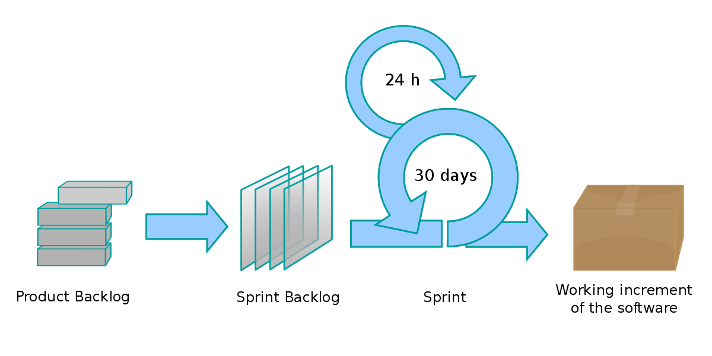

# 1.2. Processos/Metodologias/Abordagens

| Versão | Descrição                                                  | Responsáveis                                 | Revisor | Data       |
| ------ | ---------------------------------------------------------- | -------------------------------------------- | ------- | ---------- |
| 0.1    | Criação e organização dos tópicos do documento             | [Luís Lins](https://github.com/luisgaboardi) |[Murilo Perazzo](https://github.com/murilopbs)      | 24/04/2023 |
| 1.0    | Adiciona descrição e conteúdo das seções, incluido imagens | [Luís Lins](https://github.com/luisgaboardi) |[Murilo Perazzo](https://github.com/murilopbs)       | 24/04/2023 |

## Descrição

Este documento apresenta as escolhas metodológicas tomadas pela equipe, tal como a forma que se dará o desenvolvimento das atividades, a divisão e organização das tasks, os meios de comunicação e a modelagem BPMN de parte do problema.

## Escolhas Metodológicas

### SCRUM

A equipe resolver adotar uma adaptação do SCRUM, que é uma metodologia ágil que busca a entrega contínua de valor em projetos complexos e mutáveis. Ela é baseada em ciclos de trabalho chamados sprints, que geralmente duram de uma a quatro semanas. Durante cada sprint, a equipe trabalha em um conjunto específico de tarefas, as quais são definidas em um backlog, e fazem reuniões diárias para monitorar o progresso. Ao final de cada sprint, é feita uma revisão do trabalho realizado e uma retrospectiva para avaliar o processo e identificar oportunidades de melhoria para os próximos sprints. O SCRUM é bastante utilizado em equipes de desenvolvimento de software, mas pode ser aplicado em outras áreas que envolvam projetos complexos.

### Kanban

Ademais, a equipe optou por utilizar o quadro Kanban para gerenciar as atividades do projeto, pois é uma ferramenta visual que permite visualizar o fluxo de trabalho e facilita a identificação de gargalos e a distribuição de tarefas entre os membros da equipe. O Kanban consiste em um quadro com colunas que representam as etapas do processo e cartões que representam as tarefas a serem realizadas. Os cartões são movidos ao longo do quadro conforme avançam no processo, permitindo que a equipe acompanhe facilmente o status do trabalho em andamento. Em resumo, o Kanban é uma metodologia ágil que auxilia no gerenciamento visual de projetos. Para isso, utilizamos o [Trello](https://trello.com/pt-BR).

## Modelagem BPMN

O Business Process Model and Notation (BPMN) é uma notação gráfica padronizada para modelagem de processos de negócio. O BPMN oferece um conjunto de símbolos e regras para representar visualmente o fluxo de trabalho, eventos, tarefas, decisões, gateways e outros elementos de um processo. O objetivo do BPMN é melhorar a comunicação e a compreensão dos processos de negócio por parte de todos os envolvidos, incluindo analistas, gerentes, desenvolvedores e usuários finais. Mais detalhes em [1.2.1. BPMN](Base/Artefatos/1.2.1.BPMN.md).

## Bibliografia

> Schwaber, K., & Sutherland, J. (2017). The Scrum guide. Scrum.org. Recuperado em 24 de abril de 2023, de https://www.scrum.org/resources/scrum-guide

> Lima, R. (2018). O que é Kanban? E como aplicar na prática. Medium. Recuperado em 24 de abril de 2023, de https://medium.com/trainingcenter/o-que-%C3%A9-kanban-e-como-aplicar-na-pr%C3%A1tica-8064d4bc0807
