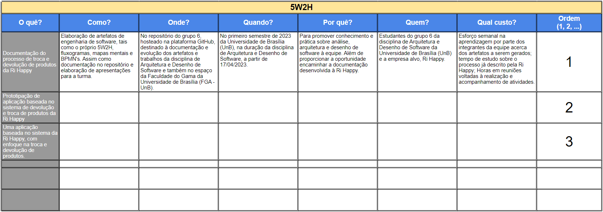

# 1.1.2. 5W2H (5 Why's, 2 How's)

## Histórico de Alterações

| Versão | Descrição | Responsáveis | Data |
| -- | -- | -- | -- |
| 0.1  | Criação e organização dos tópicos do documento | [Luís Lins](https://github.com/luisgaboardi) | 24/04/2023 |
| 0.2  | Adiciona descrição, bibliografia, imagem e link para o artefato | [Luís Lins](https://github.com/luisgaboardi) | 24/04/2023 |

## Descrição
O 5W2H pode ser utilizado como uma ferramenta para definir e implementar um plano de ação claro e completo. O 5W2H é uma técnica de planejamento que consiste em responder a sete perguntas: o quê, por quê, quem, onde, quando, como e quanto custa. Essa técnica ajuda a equipe a ter um entendimento completo sobre as atividades necessárias para atingir um objetivo específico, além de identificar possíveis riscos e planos de contingência.

## Visualização

[Link para a planilha](https://docs.google.com/spreadsheets/d/e/2PACX-1vR10MHa18rd32bkKh9eUXNH43sEaP49ChFU3YoeiUlGLwiII3XqjsRu0cXFVi-PRtAptTKHk6t1pMkA/pubhtml)

## Bibliografia
> LIMA, Rafael. Design sprint: como funciona e por que utilizar. Medium, 2018. Disponível em: https://medium.com/trainingcenter/design-sprint-como-funciona-e-por-que-utilizar-cc9c9a5a0c03. Acesso em: 24 abr. 2023.