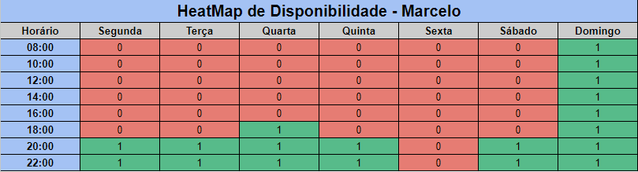

# 1.1.2. Mapa de Calor

## Histórico de Alterações

| Versão | Descrição | Responsáveis | Data |
| -- | -- | -- | -- |
| 0.1  | Criação e organização dos tópicos do documento | [Luís Lins](https://github.com/luisgaboardi) | 24/04/2023 |
| 1.0  | Adiciona descrição, imagens do HeatMap e bibliografia | [Luís Lins](https://github.com/luisgaboardi) | 24/04/2023 |

## Descrição
O mapa de calor é uma técnica utilizada para visualizar a distribuição de atividades e horários de uma equipe, a fim de identificar os períodos em que todos estão disponíveis para reuniões e trabalhos em equipe. Através dessa ferramenta, é possível identificar os horários comuns em que todos da equipe possuem disponibilidade, o que permite a definição de um horário ideal para as atividades em grupo. Essa técnica é especialmente útil em equipes que possuem membros com agendas diversas e horários de trabalho flexíveis.

## Visualização

### Geral

### Luís Guilherme

### Israel

### Murilo

### Lucas

### Marcelo

## Bibliografia
> SANTOS, T. Heatmaps: O que são, para que servem e como usar. Medium, 16 mar. 2019. Disponível em: <https://medium.com/@thaysasantos/heatmaps-o-que-s%C3%A3o-para-que-servem-e-como-usar-ac867045ae72>. Acesso em: 24 abr. 2023
