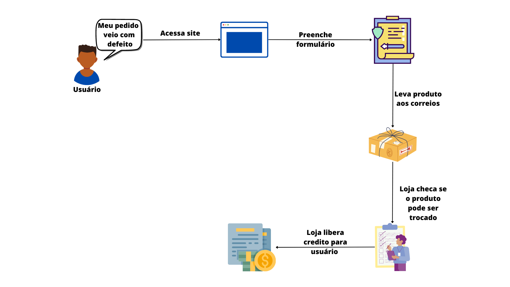
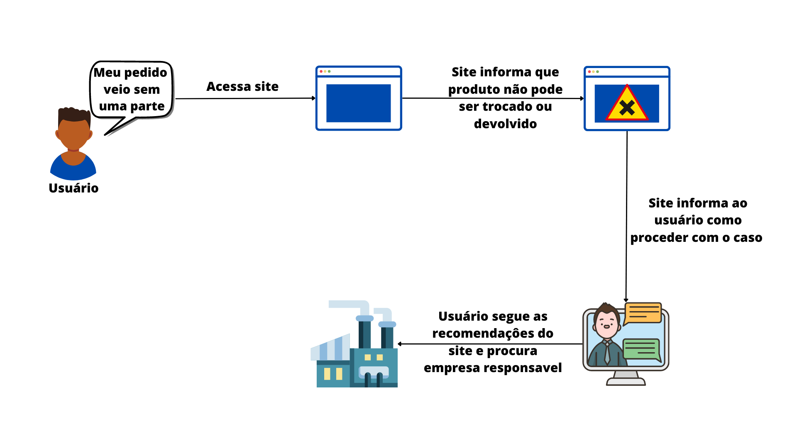

# 1.1.6. Rich Pictures

## Histórico de Alterações

| Versão | Descrição                                              | Responsáveis                                 | Revisor | Data       |
| ------ | ------------------------------------------------------ | -------------------------------------------- | ------- | ---------- |
| 0.1    | Criação e organização dos tópicos do documento         | [Luís Lins](https://github.com/luisgaboardi) | -       | 24/04/2023 |
| 1.0    | Adiciona descrição, imagens do artefato e bibliografia | [Luís Lins](https://github.com/luisgaboardi) | -       | 24/04/2023 |

## Descrição

Rich Picture é uma técnica utilizada em design thinking para criar uma visão holística e profunda de um problema ou situação complexa, utilizando imagens e símbolos para representar as interações entre as partes envolvidas. No contexto da política de troca e devolução da Ri Happy, o Rich Picture pode ser usado para identificar as necessidades e desejos dos clientes, as motivações dos colaboradores e as possíveis influências externas, permitindo uma compreensão mais ampla e aprofundada do cenário e contribuindo para a tomada de decisões mais informadas.

## Visualização

### Pedido com Defeito

### Pedido Incompleto

## Bibliografia

> CHECKLAND, P.; HOLWELL, S. Information, Systems, and Information Systems: Making Sense of the Field. Wiley, 1998.
