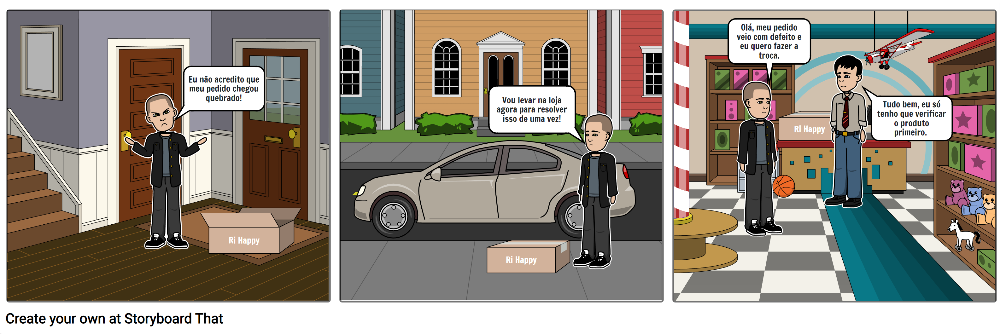
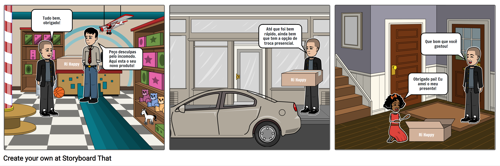

# 1.1.7. Story Telling

## Histórico de Alterações

| Versão | Descrição                                              | Responsáveis                                 | Revisor | Data       |
| ------ | ------------------------------------------------------ | -------------------------------------------- | ------- | ---------- |
| 0.1    | Criação e organização dos tópicos do documento         | [Luís Lins](https://github.com/luisgaboardi) | -       | 24/04/2023 |
| 1.0    | Adiciona descrição, imagens do artefato e bibliografia | [Luís Lins](https://github.com/luisgaboardi) | -       | 24/04/2023 |
| 2.0    | Adiciona participantes na elaboração do artefato       | [Luís Lins](https://github.com/luisgaboardi) | -       | 24/04/2023 |

## Descrição

Storytelling é uma técnica de comunicação que consiste em contar histórias para transmitir uma mensagem ou ideia de forma envolvente e memorável. No contexto de software, o storytelling pode ser utilizado para criar narrativas que ajudem a equipe a compreender as necessidades e desejos dos usuários, além de identificar oportunidades para melhorar a experiência do usuário.

## Participantes

- Marcelo Ferreira Magalhães Júnior [@marrcelo](https://github.com/marrcelo)

## Visualização

### Pedido com Defeito

## Bibliografia

> Morgan, G. (2004). Imagens da organização. São Paulo: Atlas.
