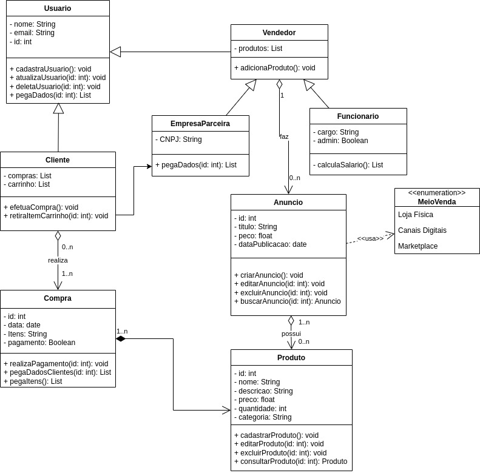

# 2.1.1.1. Diagrama de Classes - Venda

## Histórico de Alterações

| Versão | Descrição                                          | Responsáveis                                 | Data       |
| ------ | -------------------------------------------------- | -------------------------------------------- | ---------- |
| 1.0    | Criação do documento, descrição e adição de imagem | [Luís Lins](https://github.com/luisgaboardi) | 15/05/2023 |

## Descrição

O diagrama de classes é uma representação visual que descreve a estrutura e as relações entre as classes de um sistema. No contexto do processo de venda da Ri Happy, o diagrama de classes pode ser utilizado para representar as principais entidades envolvidas nesse processo e as interações entre elas.

O diagrama de classes inclue as seguintes classes principais, além de alguns enumerations:

- **Cliente**: Representa os clientes da Ri Happy que realizam pedidos de troca ou devolução.

- **Pedido**: Representa um pedido de troca ou devolução feito por um cliente. Está associado a um cliente e a um produto.

- **Produto**: Representa um produto da Ri Happy a ser objeto de troca ou devolução.

- **Analise**: Representa a análise de um pedido de troca ou devolução. Está associada a um pedido e a um avaliador responsável pela análise.

- **Avaliador**: Representa os avaliadores responsáveis por analisar os pedidos de troca ou devolução.

## Visualização

