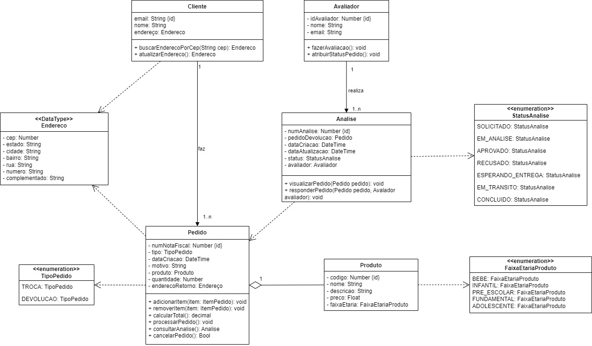

# 2.1.1.1. Diagrama de Classes - Troca e Devolução

## Histórico de Alterações

| Versão | Descrição                                          | Responsáveis                                 | Data       |
| ------ | -------------------------------------------------- | -------------------------------------------- | ---------- |
| 1.0    | Criação do documento, descrição e adição de imagem | [Luís Lins](https://github.com/luisgaboardi) | 15/05/2023 |

## Descrição

O diagrama de classes é uma representação visual que descreve a estrutura e as relações entre as classes de um sistema. No contexto do processo de troca e devolução da Ri Happy, o diagrama de classes pode ser utilizado para representar as principais entidades envolvidas nesse processo e as interações entre elas.

O diagrama de classes inclue as seguintes classes principais, além de alguns enumerations:

- **Usuário**: Representa os usuários do sistema, que podem incluir tanto clientes quanto funcionários da Ri Happy.

- **Cliente**: Representa os clientes da Ri Happy que realizam compras. É uma especialização de Usuário.

- **Compra**: Representa uma compra feita por um cliente. Está associada a um cliente e aos produtos adquiridos.

- **Vendedor**: Representa os vendedores da Ri Happy que realizam as vendas para os clientes.

- **EmpresaParceira**: Representa empresas parceiras da Ri Happy que fornecem produtos para venda no Marketplace. É uma classe filha da classe Vendedor.

- **Funcionário**: Representa os funcionários da Ri Happy envolvidos no processo de venda. É uma classe filha da classe Vendedor.

- **Anúncio**: Representa um anúncio de um produto feito pela Ri Happy. Está associado ao vendedor responsável pelo anúncio.

- **Produto**: Representa um produto disponível para venda na Ri Happy. Está associado a um anúncio e a compras relacionadas a ele.

## Visualização

