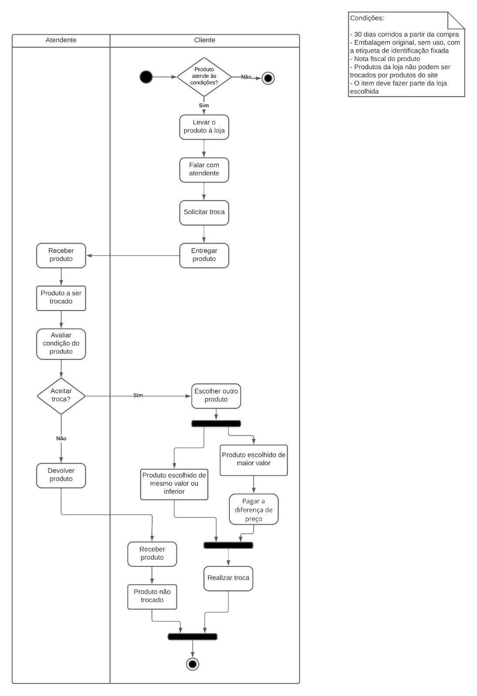

# 2.1.1.1. Diagrama de Atividades - Produto em Loja Física

## Histórico de Alterações

| Versão | Descrição                                          | Responsáveis                                 | Data       |
| ------ | -------------------------------------------------- | -------------------------------------------- | ---------- |
| 1.0    | Criação do documento e adição de imagem | [Luís Lins](https://github.com/luisgaboardi) | 15/05/2023 |
| 1.1    | Adição de descrição do diagrama | [Lucas Sales](https://github.com/lux-sales) | 15/05/2023 |

## Participantes

- Israel Thalles Dutra dos Santos [@IsraelThalles](https://github.com/IsraelThalles)

## Descrição
O diagrama de atividades é uma ferramenta de modelagem visual que descreve o comportamento de um sistema ou processo em termos de atividades, fluxos de controle e objetos envolvidos. Ele representa graficamente as atividades do sistema em uma sequência lógica e mostra como as atividades se relacionam entre si. Ele é composto por uma série de símbolos, incluindo ações, fluxos, decisões, pontos de interrupção e objetos, que ajudam a visualizar a lógica por trás do sistema ou processo.

### Este diagrama
Neste diagrama temos inicialmente um gateway de decisão informando se o produto atende as condições de troca ou não, em caso negativo, se encerra o fluxo, em positivo, se iniciam as atividades, divididas entre cliente e atendente. Os retângulos arredondados são relacionados à atividades e os retos a artefatos, como produto, os losângulos, os gateways de decisão.
## Visualização

