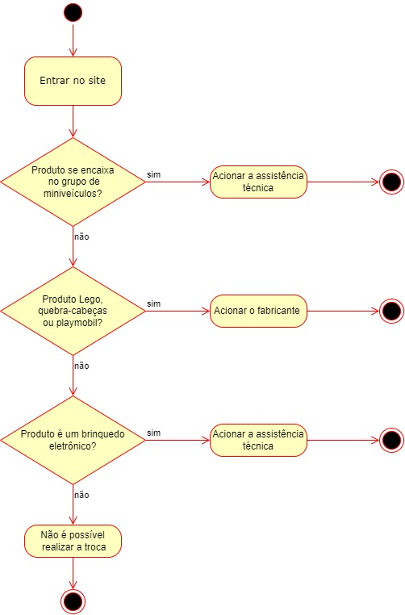

# 2.1.1.2. Diagrama de Atividades - Produto em Sem Troca

## Histórico de Alterações

| Versão | Descrição                                          | Responsáveis                                 | Data       |
| ------ | -------------------------------------------------- | -------------------------------------------- | ---------- |
| 1.0    | Criação do documento e adição de imagem | [Luís Lins](https://github.com/luisgaboardi) | 15/05/2023 |
| 1.1    | Adição de descrição do diagrama | [Lucas Sales](https://github.com/lux-sales) | 15/05/2023 |

## Descrição
O diagrama de atividades é uma ferramenta de modelagem visual que descreve o comportamento de um sistema ou processo em termos de atividades, fluxos de controle e objetos envolvidos. Ele representa graficamente as atividades do sistema em uma sequência lógica e mostra como as atividades se relacionam entre si. Ele é composto por uma série de símbolos, incluindo ações, fluxos, decisões, pontos de interrupção e objetos, que ajudam a visualizar a lógica por trás do sistema ou processo.

### Este diagrama
Neste diagrama temos uma série de gateways de decisão, pois para cada tipo de produto, temos uma solução, podendo ser acionamento de assistência técnica, acionamento de fabricante para repor peças faltantes, entre outras questões. Os retângulos arredondados são relacionados à atividades e os losângulos, os gateways de decisão.

## Visualização

