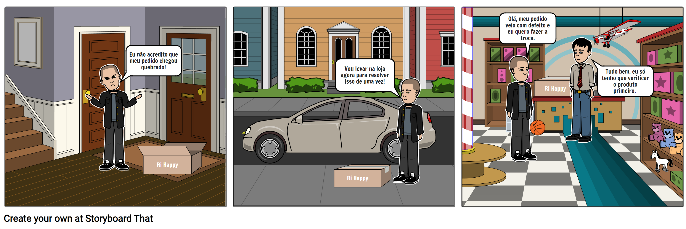
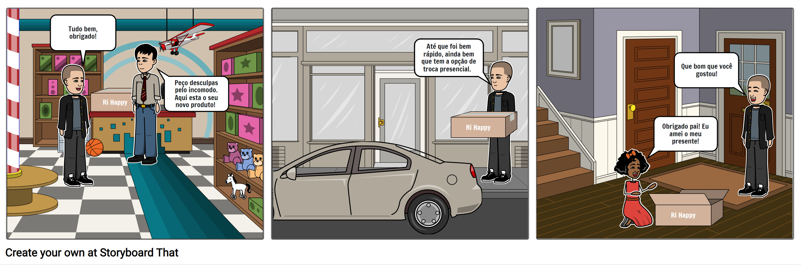

# RiHappy: Perfil Comprador & Plataforma, e fluxos compreendidos nas políticas de trocas e devoluções

**Código da Disciplina**: FGA0208 
**Número do Grupo**: G6 

## Alunos

| Matrícula  | Aluno                             | Github                                           |
| ---------- | --------------------------------- | ------------------------------------------------ |
| 18/0022962 | Luís Guilherme Gaboardi Lins      | [@luisgaboardi](https://github.com/luisgaboardi) |
| xx/xxxxxx  | Lucas Sales                       |                                                  |
| xx/xxxxxx  | Murilo                            |                                                  |
| 19/0047348 | Marcelo Ferreira Magalhães Júnior | [@marrcelo](https://github.com/marrcelo)         |
| xx/xxxxxx  | Israel                            |                                                  |
| xx/xxxxxx  | Caio                              |                                                  |
| xx/xxxxxx  | Kaique                            |                                                  |

## Sobre

Projeto da disciplina de Arquitetura e Desenho de Software da Universidade de Brasília (UnB) do semestre 2023.1, cujo tema é a análise da política de trocas e devoluções da [Ri Happy](https://www.rihappy.com.br/).

<!-- Contextualize, usando referências, links, e outros materiais como fontes. -->

## Screenshots Primeira Entrega <<FOCO: DSW(Base)>>

### Mapa Mental

<iframe width="768" height="432" src="https://miro.com/app/embed/uXjVMR6SWlc=/?pres=1&frameId=3458764552580686732&embedId=88973401414" frameborder="0" scrolling="no" allow="fullscreen; clipboard-read; clipboard-write" allowfullscreen></iframe>

### Rich Pictures

#### Pedido Incompleto

### Story Telling

#### Pedido com Defeito

<!-- Adicione 2 ou mais screenshots em termos de artefatos da Primeira Entrega. -->

<!-- ## Screenshots Segunda Entrega <<FOCO: DSW(Modelagem)>>
Adicione 2 ou mais screenshots em termos de artefatos da Segunda Entrega.

## Screenshots Terceira Entrega <<FOCO: DSW(Padrões de Projeto)>>
Adicione 2 ou mais screenshots em termos de artefatos da Terceira Entrega.

## Screenshots Quarta Entrega (FINAL) <<FOCOS: Arquitetura & Reutilização de Software & PROJETO FINAL>>
Adicione 2 ou mais screenshots em termos de artefatos da Quarta Entrega.

## Descritivo dos Principais Aspectos Técnicos
**Principal(is) Metodologia(s) Adotada(s)**: xxxxxx 
**Principais Linguagens Utilizadas e/ou Pretendidas**: xxxxxx 
**Principais Tecnologias Utilizadas e/ou Pretendidas**: xxxxxx 
**Principal(is) Estilo(s) Arquitetural(is) Adotado(s)**: xxxxxx  -->

## Há algo a ser executado?

( ) SIM

(X) NÃO

<!-- Se SIM, insira um manual (ou um script) para auxiliar ainda mais os interessados na execução. -->

<!-- ## Informações Complementares
Quaisquer outras informações adicionais podem ser descritas nessa seção. -->
